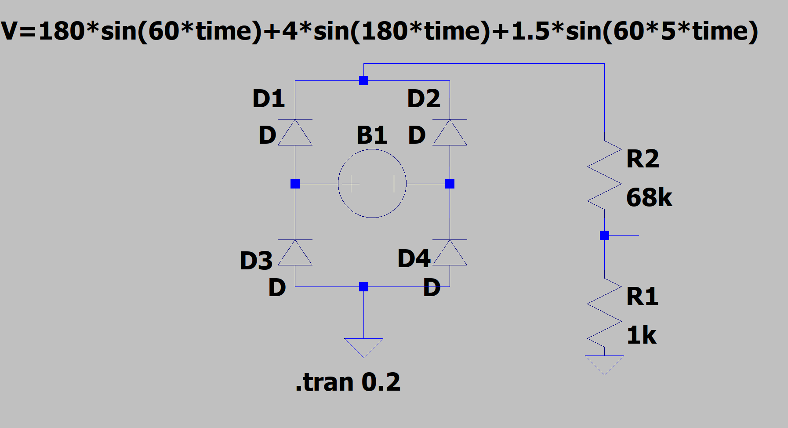

# ESP32-WATTIMETER
This project is a true rms wattimeter based in the ESP32 microcontroller. It uses the ACS712 current sensor and a shunt resistor to measure the current and the voltage. The power is calculated by the product of the current and the voltage. The power is then averaged over a period of time to get the average power. The average power is then used to calculate the true rms power. The true rms power is then used to calculate the true rms current and voltage. The true rms power, current and voltage are then displayed on a web page and on a 0.96" OLED display.

## Hardware
- ESP32 DevKitC
- ACS712 current sensor
- 0.96" OLED display
- 10MΩ  Resistor
- Hi-Link HLK-PM01 AC-DC converter 5V

## Software
- ESP-IDF

## Schematic

## Math
### Voltage
The Voltage is measured by the ADC of the ESP32. The ADC has a resolution of 12 bits and a reference voltage of 3.3V. The voltage is calculated by the formula:

```
V = (ADC * 3.3) / 4095

```

The Voltage is retified and then attenuated by a voltage divider. The voltage divider is made by a 68kΩ resistor and a 1kΩ resistor. The voltage is calculated by the formula:

```
Vout = Vin * (R2 / (R1 + R2))
```
where: R1 = 68kΩ, R2 = 1kΩ

To get the real voltage value we need to multiply the voltage by the voltage divider factor. The voltage divider factor is given by the formula:

```
V = Vout * 69
```
The circuit:


The Voltage is given by the integral of the voltage over a period of time. The integral of the voltage is given by the formula:

$$
V = \frac{V1 + V2 + V3 + ... + Vn}{n}
$$

The True RMS Voltage is given by the square root of the average of the square of the voltage over a period of time. The True RMS Voltage is given by the formula:

$$
Vrms = \sqrt{\frac{V1^2 + V2^2 + V3^2 + ... + Vn^2}{n}}
$$

So the True RMS Voltage is given by the square root of the average of the square of the voltage over a period of time. The True RMS Voltage is given by the formula:
```
Vrms = sqrt((V1^2 + V2^2 + V3^2 + ... + Vn^2) / n)
```


### Current
The datasheet for the current Sensor ACS712:


from the datasheet we can see that 0A is at 2.5V. The sensitivity is 100mV/A. The current is calculated by the formula:

The Current is measured by the ACS712 current sensor. The ACS712 has a sensitivity of 100mV/A. The current is calculated by the formula:
```
I = (((ADC * 3.3) / 4095) -2.5) / 0.1
```

The Current is given by the integral of the current over a period of time. The integral of the current is given by the formula:

$$
I = \frac{I1 + I2 + I3 + ... + In}{n}
$$

The True RMS Current is given by the square root of the average of the square of the current over a period of time. The True RMS Current is given by the formula:

$$
Irms = \sqrt{\frac{I1^2 + I2^2 + I3^2 + ... + In^2}{n}}
$$

So the True RMS Current is given by the square root of the average of the square of the current over a period of time. The True RMS Current is given by the formula:
```
Irms = sqrt((I1^2 + I2^2 + I3^2 + ... + In^2) / n)
```
